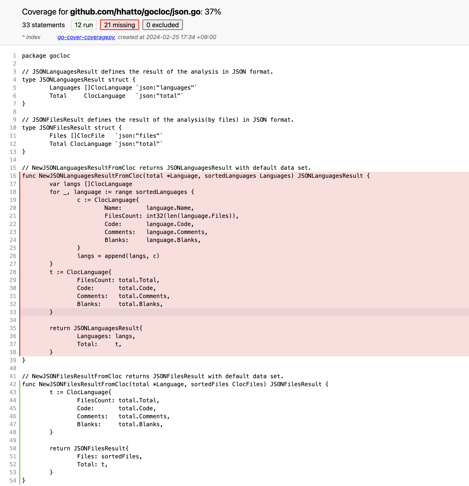

# go-cover-coveragepy

This tool outputs Go's coverage results in HTML report format in [coverage.py](https://coverage.readthedocs.io/en/).

The original HTML template used in this report is provided by coverage.py.




## Installation

require Go 1.21+

```console
go install github.com/hhatto/go-cover-coveragepy@latest
```

## Usage

```console
go-cover-coveragepy COVER.out
```

The HTML of the report is output to the `htmlcov` directory.

This can be changed with the -o option:

```console
go-cover-coveragepy -o report_html COVER.out
```


## License


